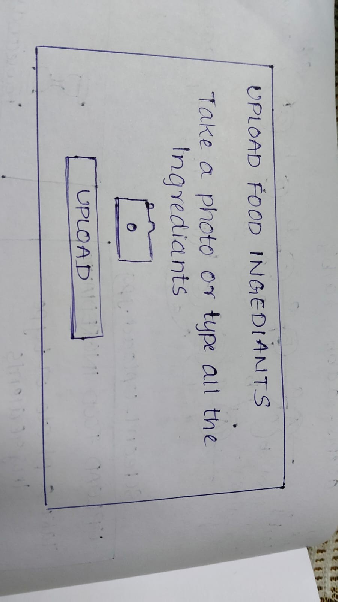
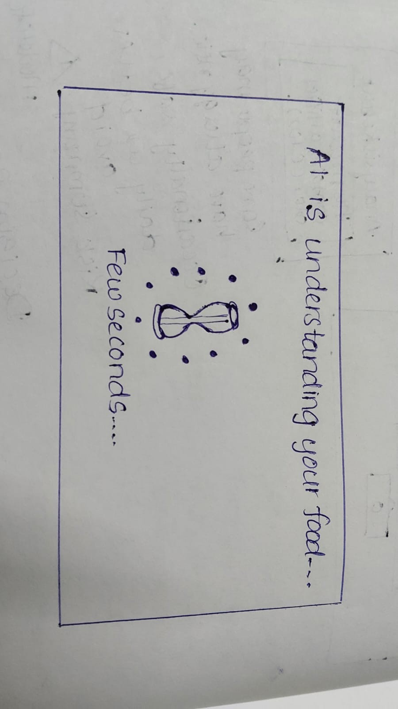
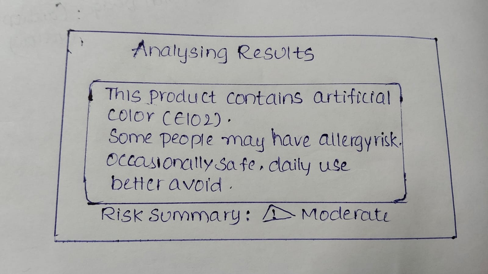

# Food Copilot Demo
AI-native food co-pilot that helps users understand food ingredients
and make better decisions at the moment of purchase.
## Problem
Food packet ingredients are hard to understand.
Chemical names, preservatives, and mixed health information confuse users
and make decision-making difficult.
## Solution
Food Copilot uses AI to:
- Interpret food ingredients
- Explain health risks in simple language
- Give a clear decision badge: OK / Caution / Avoid
## User → AI Flow
User confused  
↓  
Upload ingredients photo / text  
↓  
AI understands what matters  
↓  
AI explains in simple language  
↓  
Decision shown (OK / Caution / Avoid)
## UI Screens
### Screen 1 – Upload Ingredients

### Screen 2 – AI Processing

### Screen 3 – Analysing Result

## Sample AI Response
“This product contains artificial color (E102).
Research shows it may cause allergy risk for some people.
Occasional use is safe, but daily use is better avoided.”

## Decision Badge
⚠️ **Caution**
